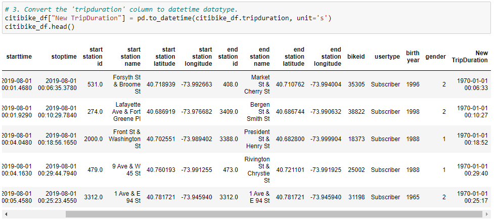
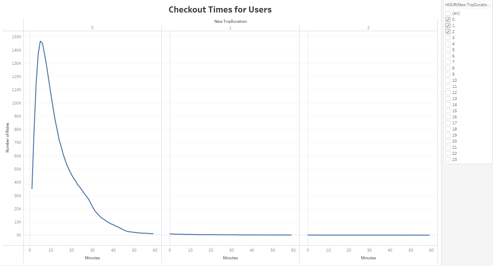
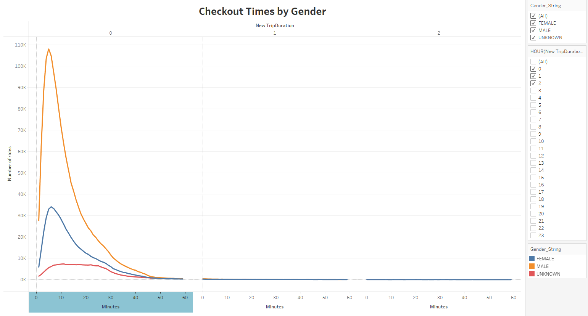
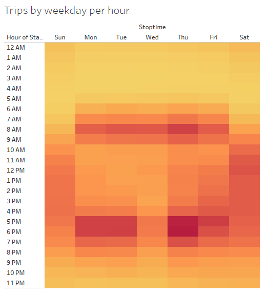
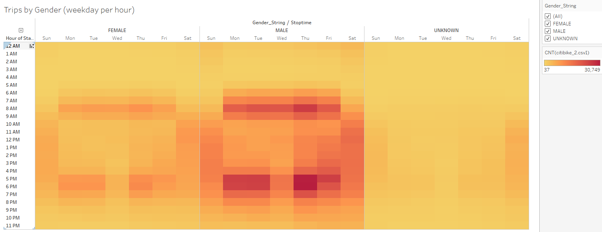
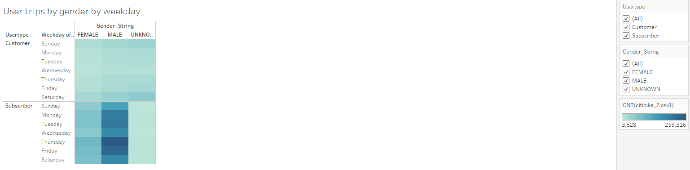
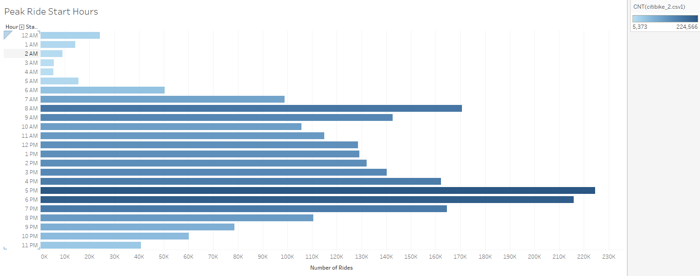
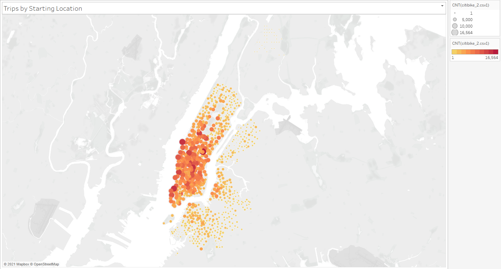

# CitiBike NYC Bike Data

## Overview
Analysing publicly available data from Citibike NYC to inform if it is profitable to start a bike share program in Des Moines. 
Using Python to re-format the data and tableau to visualise the data and showcase the insights.  

### Products used
- Tableau Public
- Python 
  - Pandas
  - datetime

### Link to tableau 
[Dashboard/Story](https://public.tableau.com/views/citibike_challenge_16387466468210/Citibike_story?:language=en-GB&publish=yes&:display_count=n&:origin=viz_share_link)  

## Using Pandas to re-format the datatypes

Using the Pandas and Datetime libraries in Python, we reformat the trip-duration data which is an integer into a datetime format.  
  

## Analysis
### Insight 1: Most trips are just 5 minutes in duration.

### Insight 2: Men take 3X more trips than women, however, women have a marginally longer trip duration

### Insight 3: Avoiding traffic is the main reason why people choose our bikes. The peak bike usage coincides with the usual peak-traffic hours. Our bikes help alleviate a pain-point of being stuck in traffic.
  

As per the above image, we can also hypothesise that people take our bikes to and from work.  
*The working male is an important demographic. However we also have opportunities to develop the women and weekend segment of the bike-share market*  

### Insight 4: The key task will be to increase subscriptions, as subscribers ride more often than non-subscribers. However this means, we are not tapping into the tourist market, who predominantly might not be subscribers.

### Insight 5: Peak ride hours are peak-traffic hours. This information will help us plan our supply and service schedules.

### Further Analysis: Trip start and end points need to be analysed further

## Summary

The key items insights from the analysis do set us up for success to launch the bike share program in Des Moines. Considering our clients were tourists who used the bike-share service, the majority of the rides happen by natives and not tourists and this is a key insight which they need to work on.  

There is some further analysis required
1. Starting and ending points split by weekdays
2. A split of tourists vs natives
3. Start and ending points split by gender to understand any nuances in gender

